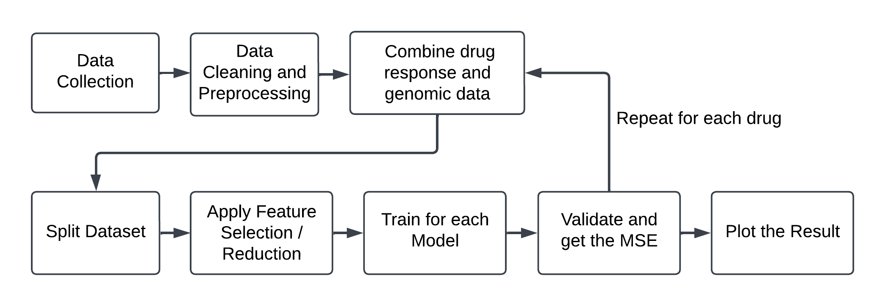
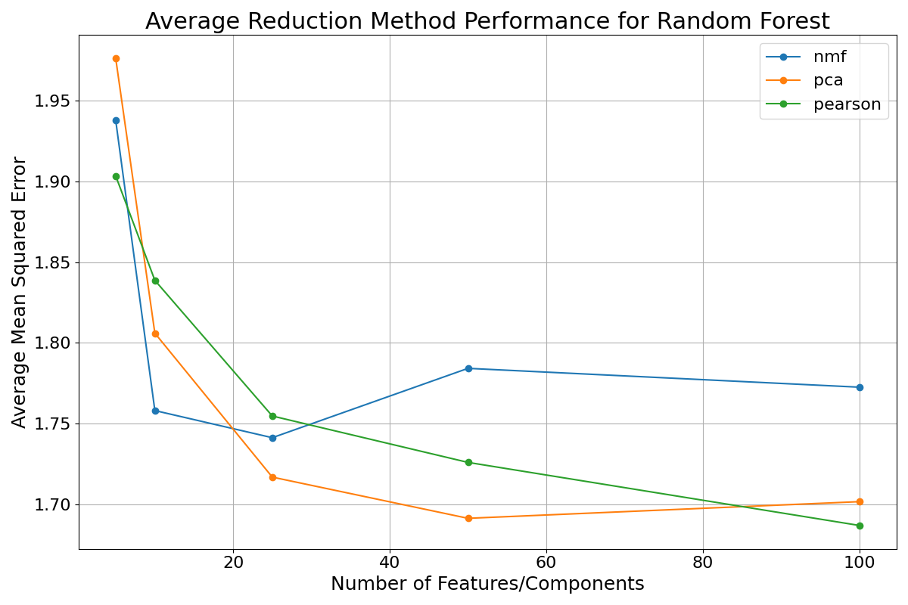
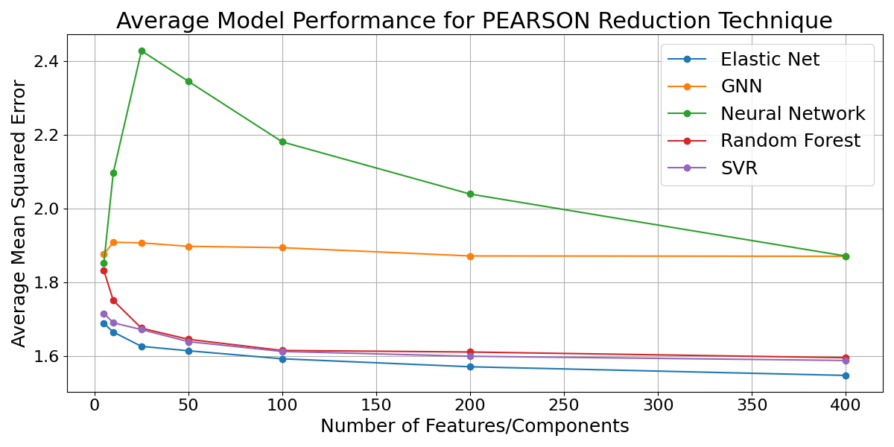
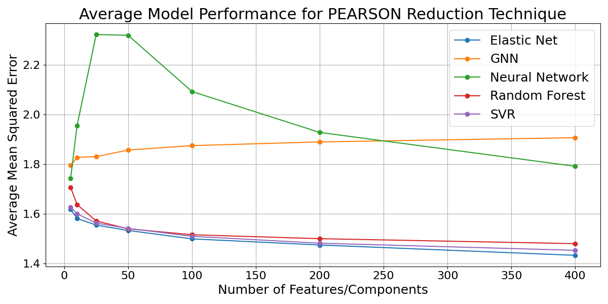

# Predicting Drug Effectiveness for Cancer Cell Lines
This project explores the use of machine learning to predict the effectiveness of drugs on cancer cell lines using genomic data. It benchmarks datasets, feature reduction techniques, and machine learning models to identify the most promising approaches for personalized cancer therapy.

## Overview
Cancer drug resistance remains a major hurdle in treatment. By leveraging genomic datasets and advanced ML techniques, this project aims to predict drug sensitivity (measured via ln(IC50) values) for various cancer cell lines, thereby contributing to precision oncology

## Datasets Used
- GDSC2 – Binary mutation data for 969 cell lines (425 genes).
- E-MTAB-3610 – Microarray gene expression data for 1,013 cell lines (20,354 genes).
- CCLE – Gene expression data for 1,964 cell lines (16,383 features).

## Feature Reduction Techniques
- PCA (Principal Component Analysis)
- NMF (Non-negative Matrix Factorization)
- PCC (Pearson Correlation Coefficient) – Best-performing technique

## Models Benchmarked
- Elastic Net (EN) – Best performer (MSE: 1.43)
- Random Forest Regressor
- Support Vector Regression (SVR)
- Multilayer Perceptron (MLP)
- Graph Neural Network (GNN)

## Workflow

Figure 1: Pipeline of drug response prediction using genomic
data

1. **Data Collection**  
   - Retrieved data from GDSC2, E-MTAB-3610, and CCLE datasets.

2. **Preprocessing**  
   - Cleaned and merged gene expression with IC50 data.
   - Filtered drugs with fewer than 500 cell lines.
   - Normalized and standardized features.

3. **Feature Reduction**  
   - Applied PCA, NMF, and PCC to reduce dimensionality.
   - Selected top-k features based on correlation or variance.

4. **Model Training & Validation**  
   - Trained models (RF, SVR, EN, MLP, GNN) using 5-fold cross-validation.
   - Optimized hyperparameters using validation set.

5. **Evaluation**  
   - Measured performance using Mean Squared Error (MSE) on the test set.
   - Compared models and feature selection techniques.

6. **Analysis**  
   - Identified Elastic Net + PCC as the best performing combo.
   - Noted performance limitations of deep models due to data size.

## Results

Figure 2: Average MSE of the Three Reduction Techniques
using the Random Forest Model


Figure 3: Average MSE Across Five Different Models using
PCC and CCLE dataset


Figure 4: Average MSE across Five Different Models using
PCC and E-MTAB-3610 dataset

## Contributors
- Parshva Shah: Elastic Net, NMF, MLP
- Aakash Durairaj: GDSC preprocessing, SVR, RF, GNN
- Kevin Qian: PCA, training, evaluation
- Supervision: Zhijie Wang and Lei Ma

## Future Work
- Integration of drug structural embeddings
- Hyperparameter tuning of deep models
- Use of multi-omics data (e.g., proteomics, transcriptomics)
- Expansion to larger and more diverse datasets

## Details
For a more detailed explanation of methods and process, please reference `results/Paper.pdf`.

# Getting Started

Follow these steps to set up and run the project locally.

### 1. Clone the Repository

```
git clone https://github.com/your-username/your-repo-name.git
cd your-repo-name
```

### 2. Create and Activate a Virtual Environment
macOS/Linux:

```
python3 -m venv venv
source venv/bin/activate
```

### 3. Install Dependencies
```
pip install -r requirements.txt
```

## 4. Run
```
python3 main.py
```
